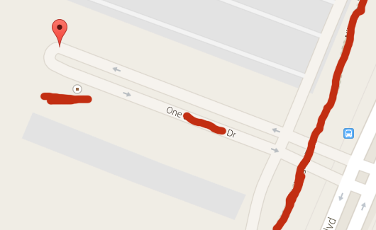
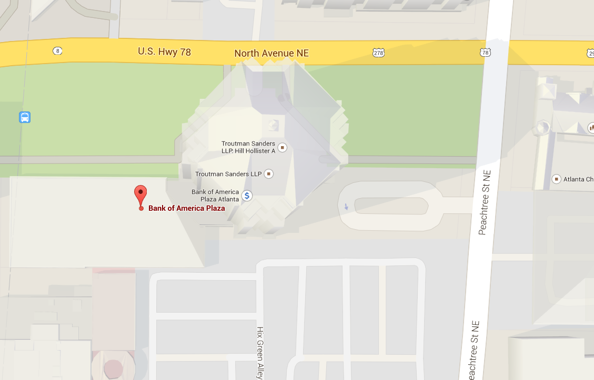
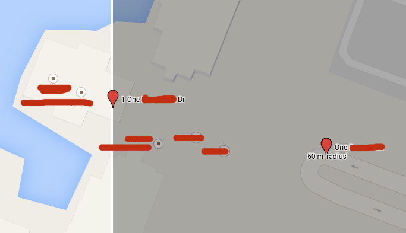

I’ve been working at [Ride.com](https://ride.com/) since October 2014, and I’ve got to do some awesome stuff with them. As far as my job has been concerned, the first 4-5 months were entirely green field development. As a team we built multiple services to compliment a central API, and with the help of some other gophers at the company I built most of a little Go service to handle various autocomplete requirements.

One of the autocomplete endpoints was for addresses, allowing us to switch map API providers without totally breaking our iOS and web apps.

I had a few clashes with the Google Maps API along the way. Some were my fault, some were their fault, and some I just blame on imperfections in U.S. address system. To be fair, the U.K. is not much better, but the U.S had a more recent opportunity to get things a bit better and they still fucked it.

## Address Autocomplete Requirements

*   Users sign up via web/iOS clients, enter their home address and enter their work address.
*   These clients call the autocomplete service with the user input.
*   See what Google Maps thinks of the input.
*   Spit out some formatted JSON for the clients to display for the user to pick.

I pretty much want to get this for homes and places of work:

~~~ json
{
  "addresses": [{
    "formatted_address": "568 Broadway, New York, NY 10012, USA",
    "street_address_1": "Broadway",
    "street_address_2": "",
    "street_number": "568",
    "neighborhood": "Lower Manhattan",
    "locality": "New York",
    "sublocality_level_1": "Manhattan",
    "sublocality_level_2": "",
    "sublocality_level_3": "",
    "administrative_area_level_1": "New York",
    "administrative_area_level_1_short": "NY",
    "administrative_area_level_2": "New York County",
    "administrative_area_level_3": "",
    "country": "United States",
    "postal_code": "10012",
    "lat": 40.7242802,
    "lng": -73.9973541,
    "google_places_id": ""
  }]
}
~~~

Simple enough right?

Heh.

## Location Biasing

A feature the web/iOS clients and business all requested rather early on was location-based biasing. This is the art of assuming that things near you are more relevant than things far away, which is pretty fair. Somebody in Florida probably doesn’t drive to work in Texas, and definitely doesn’t need to see shit in Alaska.

If we were using the Google Places API then we’d be golden because you can just give them a `?near=lat,lng` and they’ll work it out for you. Sadly, the Google Places API is not useful for us. Many work places outside of major companies are not on the places API, and obviously not many people have their homes in that API either.

We had to stick with the Google Maps API and that does not have the same functionality. Balls. Time for a dumb hack:

~~~ go
func vertexToBoundingBox(vertex Vertex) string {
  if vertex == (Vertex{}) {
    return ""
  }
  return fmt.Sprintf(
    "%f,%f|%f,%f",
    vertex.Lat - 0.5,
    vertex.Lng - 1,
    vertex.Lat + 0.5,
    vertex.Lng + 1
  )
}
~~~

This has worked well enough that most people seem happy with it. It makes a rather wide box which is big enough to contain a large US city and some surrounding suburbs.

If the coordinates Google has for the address are considered to be a hair over the line of that bounding box then the address might as well be a on the other side of the country for all it cares.

Not ideal.

## 1 One Imagination Drive

When doing research on some big corporate buildings we’d likely have people wanting to drive to, some folks at Ride spotted a problem, with a company who's name I am pretending is "Imagination".

Imagination have a vanity road called `One Imagination Drive`, which in and of itself would not be a problem other than one thing: they advertise `One Imagination Drive` as their address on all their media, not their real address of `1 One Imagination Drive`.

The autocomplete was taking their search results, Google was returning a road, the autocomplete was throwing it away. That’s how I programmed it, to throw away anything Google offers me which is not a `street_address`.

Think about it, having a road instead of an actual address could be madness for calculating how far people need to drive, and would throw off our pricing calculations.

To offer an extreme example, if you as a driver enter “Route 66” as a destination, if you stop short of wherever Google places the pin then you are going to be drastically overcharging any passengers, and the opposite problem occurs if you drive past the pin: you’ll be losing money. Our petrol costs based on milage would be screwed, even if only by a fraction in real-world usage.

As with many things in programming, we are faced with various shit options. I presenting the shit options to business:

*   Allow roads to be used as a destination address and let people potentially be miles off of their actual destination.
*   Do not support Imagination HQ and any similar building which advertises their vanity road as an address.

Yaaaaaay.

## Bank of America Plaza

Google returns components with a `types` array, which can have a plethora of values.

For a while I didn’t actually know about this type array, and was foolishly throwing away results that did not have a street_address or a route. This kicked me in the face when we realised that the Bank of America Plaza in Atlanta does not actually have a street address or route _at all_.

Looking at the building on the map you can see it has a road, but that little road has no name. It is not considered to be on Peachtree St NE, nor is it on U.S. Highway 78, it is just on bloody nothing.

If I were to remove the check that said “no street address or route = invalid address”, the code would not only allow Bank of America Plaza Atlanta, but it would also let any town or city into the results, meaning you could easily say your pickup or destination address was `West Chester, NY`, leaving the driver to do laps around a town of a few thousand trying to find you…

Google has us covered here. Allow any of the following component types:

* `route`
* `street_address`
* `premise`

If you can think of any more then please send answers on the back of a postcard.

## 1 One Imagination Drive Again

This bloody road.

At Ride we not only allow people to carpool to the same building, but we have a bit of wiggle room in there. Theoretically, if you work right next to somebody, in the same building, the next building, or the same business park, then carpooling should be an option for you.

_Some companies are against that for security reasons, but we have a switch to turn it on or off for various companies._

Anyway, we allow a radius of 50 meters for now, and yes, looking at the image below that is a “square radius”. Shut up, I didn’t want to get PostGIS involved and slow down this query for a temporary feature as the geo search is being moved out of the API anyway.

See if you can spot what is happening in this image.

Yup, you guessed it. The building "1 One Imagination Drive" is 50.5 meters away from the seemingly arbitrary point on the map that Google decides to put the pin for the road "One Imagination Drive".

I can’t remember exactly what happened, but I have a sneaking suspicion we bumped our “square-radius” to 52 meters and called it a day.

You couldn’t write this stuff.
