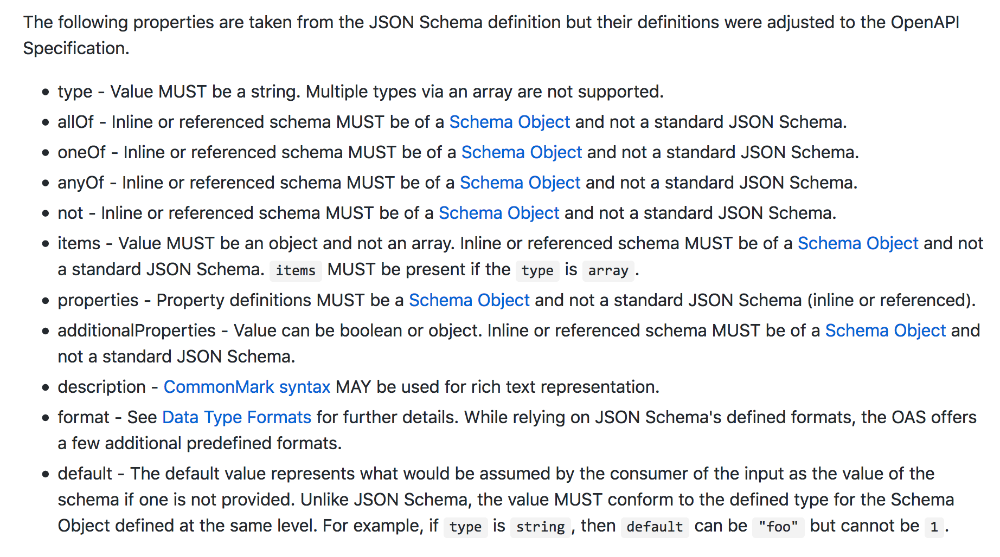
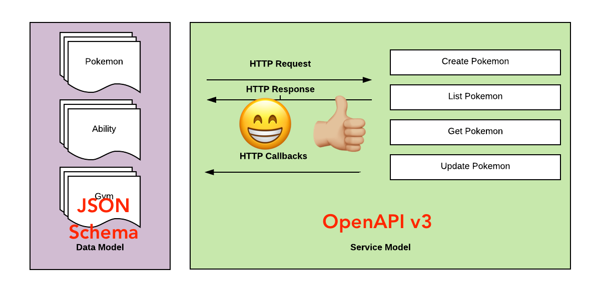

This article is going to explain the divergence between OpenAPI and JSON Schema, which I've been calling the subset/superset/sideset problem. It'll finish up explaining how we're going to solve it, and [part two explains the solution][solution].

_**Update 2020-02-02:** JSON Schema Draft 2019-09 has been published for a while, and after much deliberation we got the folks at OpenAPI to merge [#1977](https://github.com/OAI/OpenAPI-Specification/pull/1977) for v3.1. Latest estimate for v3.1.0-RC1 is end of February, so tooling vendors should get to work on upgrading support for JSON Schema 2019-09 and the other OpenAPI v3.1 changes._

<hr>

Whenever talking about API description formats it is impossible to avoid mentioning OpenAPI and JSON Schema. They're the two main solutions for any sort of API that doesn't have a type system forcibly jammed into it by default.

Often you'll need OpenAPI for one thing, and JSON Schema for another. OpenAPI has [amazing API documentation tools](https://apisyouwonthate.com/blog/turning-contracts-into-beautiful-documentation), fancy SDK generators, and handles loads of API-specific functionality that JSON Schema doesn't even go near. It also has a focus on keeping this static, for strictly typed languages, where properties should be 1 type and 1 type only.

JSON Schema focuses on very flexible data modeling with the same sort of validation vocabulary as OpenAPI, but for more flexible data sets. Whilst it doesn't focus just on APIs, by using more advanced vocabularies like [JSON Hyper-Schema](https://apisyouwonthate.com/blog/getting-started-with-json-hyper-schema) it can model a fully RESTful API and its hypermedia controls (HATEOAS). JSON Schema can [offer server-defined client-side validation](https://apisyouwonthate.com/blog/the-many-amazing-uses-of-json-schema-client-side-validation), and a bunch of other fantastic stuff that OpenAPI doesn't really aim to do.

Over the last year I've been [chasing the perfect workflow](https://phil.tech/api/2017/07/20/my-vision-for-a-perfect-world-in-api-specification/), and one of my main requirements when evaluating the common API specs was JSON Schema support. The situation overall was pretty bleak, not just in supporting JSON Schema, but a lot of tooling was just... not great.

Eight months after that article things are _better_, and the API design-first workflow I've been dreaming of [has been maturing](https://phil.tech/api/2018/03/01/api-specification-workflow-matures/) around me to a point where I'm really happy about most stuff!

OpenAPI is often described as an extension of JSON Schema, but both specs have changed over time and grown independently. OpenAPI v2 was based on JSON Schema draft v4 with a long list of deviations, but OpenAPI v3 shrank that list, upping their support to draft v5 and making the list of discrepancies shorter. Despite OpenAPI v3 closing the gap, the issue of JSON Schema divergence has not been resolved fully, and with newer drafts of JSON Schema coming out, the divergence is actually getting worse over time. Currently OpenAPI is still on draft 5, and JSON Schema has released draft 8.



I've been punting this issue for a while in my articles and recommendations at work. The hope was that by the time folks at work had upgraded to v3, there might be a v3.1 out solving the situation, but that has not come to pass. Now I find myself suggesting folks find some way to convert one to the other, or try to write JSON Schema that _is_ compatible with OpenAPI.



The latter can be done, but eventually you'll get bit by something. At work we've been writing JSON Schema files, using them for contract testing and a bunch of other stuff, then rendering them as part of our OpenAPI Docs with ReDoc. ReDoc will let you use `type: [string, null]`, but now we've got [Speccy](https://github.com/wework/speccy) linting our packages, it's reporting that as invalid OpenAPI...

```shell
$ speccy lint docs/openapi.yml
Specification schema is invalid.

#/paths/~1foo/post/requestBody/content/application~1json/properties/user_uuid
expected Array [ 'string', 'null' ] to be a string
    expected Array [ 'string', 'null' ] to have type string
        expected 'object' to be 'string'
```

If I change that to valid OpenAPI and use `type: string` with `nullable: true` instead, validators like Speccy will be happy, but my JSON Schema contract tests will break as they no longer know that `null` is an acceptable value for that field.

This error was the final straw for me. At work I have been recommending everyone enable Speccy on CircleCI to (amongst other things) make sure we're writing valid OpenAPI, and I am failing to write valid OpenAPI in an API I manage. I'm also a little tired of explaining this awkward difference to people who would like to use some JSON Schema-based tools.

After grumping at Darrel Miller (a contributor to OpenAPI) and others on the [APIs You Won't Hate slack](https://slack.apisyouwonthate.com/), some good ideas started to pop up. Darrel is going to try and draft up an extension to OpenAPI that could theoretically end up in a future version - like 3.1 or 4.0:

```yaml
x-oas-draft-alternate-schema:
  schemaType: json-schema-07
  schemaRef: ./myrealschema.json
```

This would allow support for various JSON Schema drafts, and any other data model you can think of; including protobuf. The decisions of which data model formats to support would be in the hands of tool vendors. Of course this would increase work for these vendors, and decrease portability for a while as you can only use tools that support your alternate schea, but ultimately solve a _lot_ of problems.

There's some stuff to flesh out, and obvious limitations around which schemas can \$ref which other schemas, but there is definitely a solution here. It'll take some time to get it done, and in that time we all need a solution.

One approach would be trying to use OpenAPI for all the things, write validators and RSpec tools that do this, but we'd have to be 100% OpenAPI for everything, and we'd never get to play with client validation, Hyper-Schema, etc.

Another approach would be converting our OpenAPI models to JSON Schema, but that seems a bit lossy. OpenAPI v3 is based on JSON Schema draft v5, and at time of writing JSON Schema is up to draft v8... This also adds a build step that gets in the way. If you are using JSON Schema for your contract testing, with something like [thoughtbot/json_matchers](https://github.com/thoughtbot/json_matchers), you would need to edit your OpenAPI model, run the conversion, then run the tests. Or crowbar a conversion into your test suite, meaning the tool handling the conversion needs to be written in that specific language... or pipe a shell command to the CLI... AGH RUN AWAY.

No, I think making JSON Schema (latest possible draft) the one and only source of truth for the data model, then "downgrading" to a flavour of JSON Schema that OpenAPI likes, is going to be the way to go.

To do this, a suite of JavaScript tools are going to be created.

### json-schema-to-openapi

Basically I'm going to flip [openapi-to-json-schema](https://github.com/mikunn/openapi-schema-to-json-schema) around.

A simple CLI package that will take a JSON Schema draft 4 file, and make it perfectly OpenAPI friendly, stripping out any keywords that would cause harm.

**Update 2018-05-17:** Done! Here is [json-schema-to-openapi-schema](https://github.com/wework/json-schema-to-openapi-schema)

### json-schema-translator

Henry Andrews (author of JSON Schema) is going to release this package, to convert files from any draft version to any other by stepping up and down. This will be really handy for all sorts of things, the most obvious use being upgrading schema files when new drafts come out.

This package will be used by json-schema-to-openapi to accept input in any JSON Schema draft version, and migrate it to v5 before converting to OpenAPI.

**Update 2018-05-17:** Almost done! Here is [json-schema-tools](https://github.com/cloudflare/json-schema-tools/), which contains a bunch of stuff including [json-schema-walker](https://github.com/cloudflare/json-schema-tools/tree/master/workspaces/json-schema-walker), for stepping through subschemas and all sorts of handy stuff. [json-schema-translator](https://github.com/cloudflare/json-schema-tools/tree/master/workspaces/json-schema-transform) is still being developed, so subscribe to this repo for updates.

### Speccy to the rescue

Right now Speccy has a few commands: lint, serve, resolve.

Lint checks the files are valid, serve creates a HTTP server and renders your docs with ReDoc, and resolve pulls in all the \$ref's to create one mega-file. All of these commands could support a `-j / --json-schema` switch, which would send all `.json` files off to json-schema-to-openapi.

Conversion this way should avoid the need for a build step. Changing the JSON Schema data model files mean anything you're using JSON Schema for (contract testing for example) are already happy.

Stuff you're doing locally with OpenAPI is usually checking the docs after editing the files, or linting things to see if your changes are ok. Both of these workflows will continue to work once Speccy is passing things through the convertor at run time, and if you _do_ need pure OpenAPI you can use resolve to create a plain OpenAPI file. 😁

So, with the problem well and truly understood and explained, let's get to work on fixing it! Darrel, Henry, and myself, will all be hard at work: just for you!

Get in touch on [APIs You Won't Hate Slack](https://slack.apisyouwonthate.com/) if you're interested. We have #openapi, #json-schema and a bunch of other channels.

**Part Two:** [Problem Solved!][solution]

[solution]: /api/2018/04/13/openapi-and-json-schema-divergence-solved/
