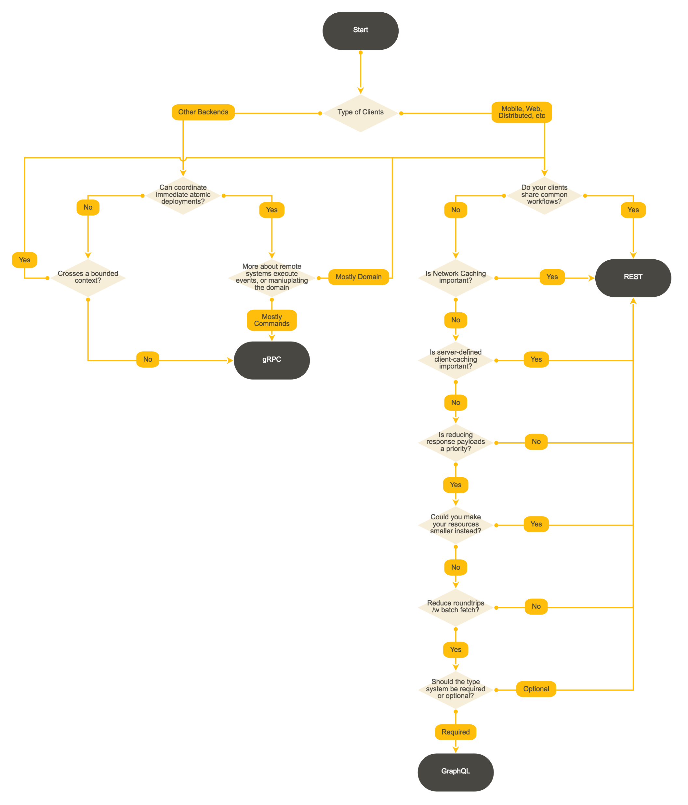
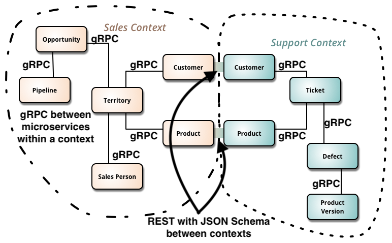

A while back I wrote an article called [Understanding RPC, REST and GraphQL](https://blog.apisyouwonthate.com/understanding-rpc-rest-and-graphql-2f959aadebe7) which outlined the "what" in how these various approaches differ. This got a few people thinking I was saying REST was drastically superior in all ways, which is a common conclusion when folks hear me describe REST as a layer of abstractions on top of RPC... More abstractions does not mean definitively "better", sometimes that's going to be overkill, so let's look at when you might want to use which.

## Paradigm, Implementation, Specifications

To oversimplify things a bit, it's reasonably fair to say that all APIs conform to a paradigm: "RPC", "REST", or "query language". These are general approaches to building APIs, but not a specific tool or specification. They are merely a concept, not a tangible thing.

Implementations are something you can actually download, install, and use to build an API, that conforms to whatever rules the implementors picked, from whichever paradigms they wanted to use at the time.

Specifications (standard, recommendation, etc.) are often drafted up by various working groups, to help implementations share functionality in the same way. An API and a client in different languages can work together perfectly if they're all following the specification correctly.

For example:

- [SOAP](https://www.w3.org/TR/soap/) is a W3C recommendation, following the RPC paradigm, with implementations like [gSOAP](https://www.genivia.com/dev.html)
- [gRPC](https://grpc.io/) is a implementation, following the RPC paradigm, which has no standard or specification by any working group, but authors Goolge Inc. did [document the protocol](https://github.com/grpc/grpc/blob/master/doc/PROTOCOL-HTTP2.md)
- [REST](https://www.ics.uci.edu/~fielding/pubs/dissertation/top.htm) is a paradigm, which has never been turned into a specification, and has no official implementations, but building a REST API is usually just a case of picking [appropriate standards](http://standards.rest/) and tooling

As you can see a direct comparison between any of these things is difficult, but at WeWork I needed to find a way to help people make decisions about how to build an API.

## Why?

Every paradigm has gone through a few years of being the hot trend, then they pass to the left, and it all circles around over, and over, and over again. Often a new implementation will be the thing that makes a paradigm the hot thing again, like gRPC.

With gRPC basically being modern SOAP, both of which are RPC with a required type system in there, RPC is back in the lime light, when it was shunned for decades. Jumping on the latest hot trend for your API is a great way to build something you (or your team) end up really resenting, so finding a way to logically help folks make informed decisions is important.

## Making Decisions

I initially wanted to make a diagram to point folks to the appropriate paradigm, but that gets really open-ended. For example, you might want to ask if having a type-system is important for the messages, but some implementations and standards from all three mentioned paradigms use types, and some do not.

Making the decision between pradigms alone was so vague it was useless, so instead we went with deciding between gRPC, REST, and GraphQL. This is absolutely a false trichotomy as we could have brought XML-RPC, JSON-RPC, SOAP, SPARQL, FIQL, Micro, ... 😴

Too much choice is no good for anyone, so we decided to choose one implementation for RPC, one implementation for query languages, and REST is in there with our own custom implementation (we have a template new APIs are built from, which will eventually be generated from OpenAPI files).

## Here Goes!

Wait, what is that "context boundary" thing all about?! Basically, it's the idea that whenever a the line is crossed between any imaginary boundary, a few more layers of abstraction should be used to help with the longevity of the system. REST provides those layers of abstraction, and GraphQL provides a few too.

That boundary could be as simple as another team/department/company, or a group of systems that just shouldn't know about each other. Things within the context can treat their own APIs like "private classes" in programming languages, they can change whenever they want, spin up and down, delete, evolve, change, who cares. When going to another context... probably use things like REST (with Hypermedia and JSON Schema) to help those clients last longer without needing developer involvement for most change.

This bounded context bit is really the crux of a lot of the deciding between when to use gRPC, and when to use something else. Internally you can do whatever you want, but when there's a chance that the developers involved in clients and servers not in close communication (when they have other priorities in the sprint, are on a work retreat, or literally don't know each other or have any way to communicate), these layers of abstraction become a lot more useful.

Pushing [client-side validation to JSON Schema](https://blog.apisyouwonthate.com/the-many-amazing-uses-of-json-schema-client-side-validation-c78a11fbde45), for instance, is a layer of abstraction that REST allows (and you could totally do in your own RPC APIs if not using gRPC).

Another example would be [pushing workflows and resource state to the API](https://blog.apisyouwonthate.com/representing-state-in-rest-and-graphql-9194b291d127) instead of having your RPC clients have to try and figure it out by looking at random properties.

The when here is important, because should every API be REST or RESTish? Hell no! But REST is very important for more use-cases than folks seem to think these days.

GraphQL fits in here when the more important parts of REST are not relevant, and the shape of clients is super different from each other. We've not been recommending it actively at WeWork, and one of the two teams using it has ditched the thing, but I do expect to see it pop up after making this diagram part of our API design guide.

### Implementations

gRPC and GraphQL have officially approved implementations for a wide array of languages, so use those as a starting point.

- [gRPC](https://grpc.io/)
- [GraphQL](http://graphql.org/)

For those of you not working at WeWork (we're hiring, [get in touch](mailto:phil.sturgeon@wework.com)!), there is a bunch of REST tooling floating around that's not awful.

- [API Platform](https://api-platform.com/)
- [Apigility](https://www.apigility.org/)
- [Flask-Potion](https://github.com/biosustain/potion)
- [Fusio](http://fusio-project.org/)
- [Go has a bunch of frameworks](https://nordicapis.com/7-frameworks-to-build-a-rest-api-in-go/)
- [Silkapp](https://github.com/silkapp/rest)
- [VertX](https://vertx.io/docs/#web)
- [jsonapi-rb](https://github.com/jsonapi-rb/jsonapi-rb)

It certainly would be lovely if there was a go-to REST implementation, like gRPC + HTTP URLs + with JSON Schema for [client+server-side validation](https://blog.apisyouwonthate.com/the-many-amazing-uses-of-json-schema-client-side-validation-c78a11fbde45) and [discovery through HATEOAS](https://blog.apisyouwonthate.com/getting-started-with-json-hyper-schema-part-2-ca9d7ffdf6f6)... that'd be dope.
